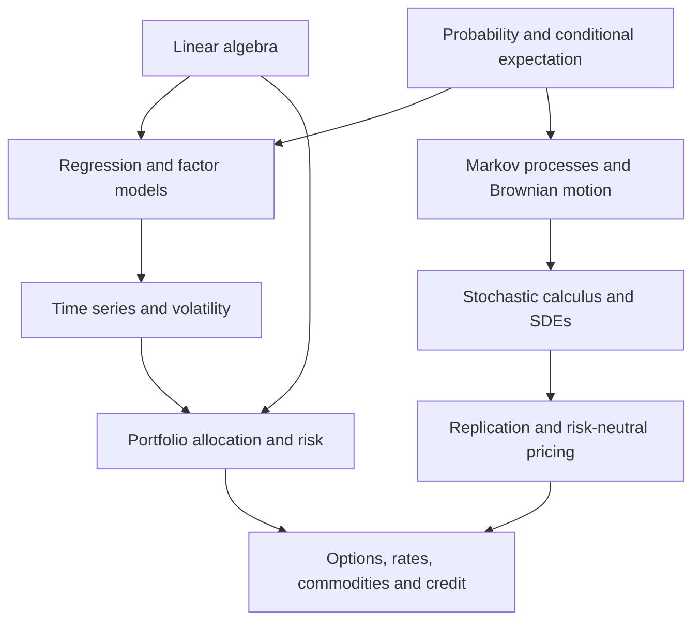

# MIT OCW: Topics in Mathematics with Applications in Finance

Research guide to **18.S096, Fall 2013**, and **18.642, Fall 2024**. Researched September 25–26, 2026, using MIT's public course materials.

This course teaches how mathematical models turn financial questions into calculations: estimating relationships, forecasting uncertainty, allocating capital, pricing contingent payoffs, and constructing hedges. Its particular strength is the connection between mathematical foundations and examples presented by practitioners. My assessment is that it provides a broad foundation for quantitative finance, with substantial specialist applications; each major subject can support much deeper study of its own.

MIT explicitly identifies 18.642 as the updated successor to 18.S096 and links learners in both directions. Studying only the newer version would miss some specialist material in the earlier offering. [2013 course](https://ocw.mit.edu/courses/18-s096-topics-in-mathematics-with-applications-in-finance-fall-2013/), [2024 course](https://ocw.mit.edu/courses/18-642-topics-in-mathematics-with-applications-in-finance-fall-2024/).

## Read the research

The report is split into linked chapters so the lecture-level detail remains usable:

| Chapter | Contents |
|---|---|
| [2013 lectures 1–13](./research-2013-lectures-01-13.md) | Every scheduled topic from financial instruments through linear algebra, probability, regression, time series, volatility, regularization, and commodities; equations, assumptions, applications, and study prompts. |
| [2013 lectures 14–26](./research-2013-lectures-14-26.md) | Portfolio and factor theory, Brownian motion, Itô calculus, derivative pricing, SDEs, execution, quanto credit, HJM, Ross recovery, and counterparty risk. |
| [Complete 2024 lecture map and changes](./research-2024-update.md) | All 26 numbered sessions across 15 weeks, available recordings and files, refreshed examples, and new practitioner topics. |
| [Assignments and case studies](./assignments-and-case-studies.md) | All nine 2013 and five 2024 problem sets, six 2013 case studies, student projects, the investment exercise, and independent project ideas. |

The chapters distinguish actual published teaching material, student-selected research subjects, and my explanatory extensions. They map every scheduled session; they do not claim that every minute of every recording was watched. Some scheduled teaching is unavailable publicly, as documented below.

## Course structure and preparation

| | Fall 2013 | Fall 2024 |
|---|---|---|
| Course number | 18.S096 | 18.642 |
| Main instructors | Peter Kempthorne, Choongbum Lee, Vasily Strela, Jake Xia | Peter Kempthorne, Vasily Strela, Jake Xia |
| Schedule | 26 numbered topical lectures | 26 numbered sessions, including four student-presentation sessions |
| Distinctive emphasis | Broad statistics/stochastic-calculus sequence plus rates, commodities and credit applications | Refreshed empirical work plus PCA strategy applications, margin optimization, biomedical financing, event markets and machine learning |
| Practical resources | Problem sets, R-based case studies, final-paper suggestions | Problem sets, R/R Markdown resources, a Python PCA notebook, group work, final paper, investment exercise |

The dates and sessions come from the [2013 calendar](https://ocw.mit.edu/courses/18-s096-topics-in-mathematics-with-applications-in-finance-fall-2013/pages/calendar/) and [2024 calendar](https://ocw.mit.edu/courses/18-642-topics-in-mathematics-with-applications-in-finance-fall-2024/pages/calendar/). The detailed chapters cite the corresponding teaching resources.

Both syllabi expect mathematical preparation. The 2013 list includes single- and multivariable calculus, differential equations, probability/statistics, and linear algebra. The 2024 list specifies differential equations or instructor approval, probability/statistics, and linear algebra. Prior finance knowledge is not required. Both schedule two 90-minute sessions per week. [2013 prerequisites](https://ocw.mit.edu/courses/18-s096-topics-in-mathematics-with-applications-in-finance-fall-2013/pages/syllabus/), [2024 prerequisites](https://ocw.mit.edu/courses/18-642-topics-in-mathematics-with-applications-in-finance-fall-2024/pages/syllabus/).

As a practical readiness check, you should be comfortable differentiating multivariable functions, integrating densities, computing conditional expectations, multiplying matrices, interpreting eigenvectors, solving simple differential equations, and reading a regression table. That checklist is my translation of the prerequisites into working skills. R is useful for reproducing the supplied examples; the mathematical ideas can also be implemented in another language.

## How the subjects connect

This is a conceptual dependency map, not the literal lecture order. In particular, practitioner lectures sometimes introduce an application before all its mathematical machinery has been developed.

| Subject family | What you learn to do | 2013 location | 2024 location |
|---|---|---|---|
| Financial instruments and bond mathematics | Translate contractual cash flows into values and sensitivities | 1, 10, 24 | 1, 7 |
| Matrix methods | Decompose data and solve linear systems | 2 | 2, 4 |
| Probability and discrete processes | Describe uncertainty, conditional information and transitions | 3, 5 | 4–6 |
| Regression and inference | Estimate relationships and test model restrictions | 6 | 6, 8, 11 |
| Time-series dynamics | Model lags, persistence, stationarity and latent state | 8, 11, 12 | 12; related assignments |
| Volatility | Distinguish measurement, conditional prediction and option-implied quantities | 9 | 19 |
| Portfolio and factor models | Relate allocation to covariance, exposures and constraints | 14–16 | 9, 13; earlier portfolio examples |
| Risk and stable calibration | Measure losses and control sensitivity to noisy inputs | 7, 10, 26 | 10; 7, 13 |
| Brownian motion and Itô calculus | Transform stochastic processes correctly | 17, 18, 21 | 14, 24, 25 |
| Derivative valuation | Price through replication and an appropriate pricing measure; relate strike derivatives to payoff distributions | 19, 20 | 21, 25 |
| Commodities and operational options | Value storage and generation flexibility | 13 | No dedicated calendar session |
| FX execution | Optimize an execution path; actual lecture unavailable | 22 | No dedicated calendar session |
| Rates, credit and probability recovery | Model curves, default-linked exposures and inferred beliefs | 23–26 | Rates 7; counterparty optimization 10 |
| Machine learning and broader applications | Explore pricing surrogates, hedging policies, financing and event exchanges | No corresponding dedicated sessions | 18, 20, 23 |

This table is an index to the sourced lecture chapters. An absent dedicated session does not establish that a topic never appears incidentally elsewhere.

## The mathematics that ties the course together

The equations below are an original compact study sheet in consistent notation. They summarize standard mathematical relationships; the lecture chapters give their specific course context and assumptions.

### Cash flows, discounting and interest-rate sensitivity

For deterministic promised cash flows $CF_i$ paid at times $t_i$, with credit and other contractual complications handled separately,

$$P=\sum_i CF_iD(0,t_i).$$

A yield-to-maturity convention compresses a bond's price into one rate. For annual compounding and integer annual payment dates, $P(y)=\sum_i CF_i(1+y)^{-t_i}$. A curve instead assigns a discount factor to each maturity. Bootstrapping solves these factors sequentially from instrument prices and cash-flow equations.

For small parallel changes in the quoted yield,

$$\frac{\Delta P}{P}\approx-D_{\mathrm{mod}}\Delta y+\frac12 C(\Delta y)^2,$$

where $D_{\mathrm{mod}}=-P'(y)/P(y)$ and $C=P''(y)/P(y)$. Duration captures first-order sensitivity; convexity supplies curvature. Curve-shape changes generally require more detailed sensitivities. [2024 bond-math session](https://ocw.mit.edu/courses/18-642-topics-in-mathematics-with-applications-in-finance-fall-2024/pages/week-1/).

### Regression, covariance and portfolio choice

For $y=X\beta+\varepsilon$, ordinary least squares minimizes $\|y-X\beta\|^2$. Full column rank gives $\hat\beta=(X^\top X)^{-1}X^\top y$. In computation, QR or SVD can solve the problem without explicitly forming the inverse.

If returns have mean vector $\mu$ and covariance $\Sigma$, a fixed-weight portfolio has

$$E[R_p]=w^\top\mu,\qquad \operatorname{Var}(R_p)=w^\top\Sigma w.$$

One common allocation problem minimizes $w^\top\Sigma w$ subject to a target mean, $1^\top w=1$, and any position constraints. The answer is conditional on estimated inputs. A mathematically exact optimum can change sharply when those inputs change.

**Original numerical illustration:** two uncorrelated assets with 20% volatility each, held equally, produce variance $0.25(0.20)^2+0.25(0.20)^2=0.02$, hence approximately **14.14% volatility**. If their correlation is one, the same portfolio has 20% volatility. The diversification effect is a covariance calculation, not a count of tickers. The course's [portfolio case study](https://ocw.mit.edu/courses/18-s096-topics-in-mathematics-with-applications-in-finance-fall-2013/f9775f1179d20bc788a0d1a623107a7b_MIT18_S096F13_CaseStudy6.pdf) explores this family of questions.

### Conditional dynamics and changing uncertainty

An AR(1) model, $X_t=c+\phi X_{t-1}+\varepsilon_t$, has a stationary causal solution for $|\phi|<1$ when its innovations satisfy the standard finite-variance assumptions. Its mean is $c/(1-\phi)$. A unit-root process behaves differently; fitting a high-persistence level series without checking stationarity can distort interpretation.

GARCH(1,1) models conditional variance:

$$\varepsilon_t=\sigma_tz_t,\qquad
\sigma_t^2=\omega+\alpha\varepsilon_{t-1}^2+\beta\sigma_{t-1}^2.$$

With standardized innovations and usual parameter restrictions, finite unconditional variance additionally requires $\alpha+\beta<1$. This allows risk to be predictable even when the conditional mean offers little predictive power. The [Treasury time-series case](https://ocw.mit.edu/courses/18-s096-topics-in-mathematics-with-applications-in-finance-fall-2013/080e2e5b442051fae5099cf224f58c0f_MIT18_S096F13_CaseStudy3.pdf) and [FX volatility case](https://ocw.mit.edu/courses/18-s096-topics-in-mathematics-with-applications-in-finance-fall-2013/809b321c4ffe634b3db0e8c59c4049df_MIT18_S096F13_CaseStudy4.pdf) provide empirical counterparts.

### Stochastic calculus and no-arbitrage pricing

Let $dS_t=\mu S_tdt+\sigma S_tdW_t$ with constant coefficients. Applying Itô's rule to $\log S_t$ gives

$$d\log S_t=(\mu-\tfrac12\sigma^2)dt+\sigma dW_t.$$

The extra second-derivative term reflects nonzero quadratic variation. Ordinary calculus alone would miss it. Dynamic replication then leads, under the standard frictionless, constant-rate, constant-volatility, non-dividend-paying stock model, to

$$\frac{\partial V}{\partial t}+rS\frac{\partial V}{\partial S}
+\tfrac12\sigma^2S^2\frac{\partial^2V}{\partial S^2}-rV=0.$$

For a European payoff $g(S_T)$, the corresponding valuation is

$$V_t=e^{-r(T-t)}E^Q[g(S_T)\mid\mathcal F_t].$$

The stock's physical drift $\mu$ disappears from the pricing equation. This is why forecasting a stock and pricing an option on it are different problems. [2024 risk-neutral valuation slides](https://ocw.mit.edu/courses/18-642-topics-in-mathematics-with-applications-in-finance-fall-2024/mit18_642_f24_lec21.pdf).

**Original one-step example:** a stock costs $100 and ends at $115 or $90. The risk-free gross return is $1.02. A $100-strike call pays $15 or $0. Its pricing probability is

$$q=\frac{102-90}{115-90}=0.48,\qquad C_0=\frac{0.48\times15}{1.02}=\$7.0588.$$

Hold 0.6 shares and borrow $54/1.02 today: the terminal portfolio pays $15 in the up state and $0 in the down state. The same initial value follows from replication. We never specified the actual probability of an up move. This example illustrates the course's [one-period market framework](https://ocw.mit.edu/courses/18-642-topics-in-mathematics-with-applications-in-finance-fall-2024/mit18_642_f24_lec02_2.pdf).

## Distinctions to retain while studying

| Terms easily confused | Difference that matters |
|---|---|
| Physical probability $P$ / pricing probability $Q$ | Forecasts of outcomes and weights used for valuation need not coincide. |
| Expected payoff / option price | Pricing generally also requires discounting, risk adjustment, and replication or an appropriate model. |
| Historical / conditional / implied volatility | A backward-looking estimate, a forecast given information, and a parameter inferred from option prices answer different questions. |
| VAR / VaR | Vector autoregression models joint time-series dynamics; value at risk is a loss quantile. |
| VaR / expected shortfall | The former gives a threshold; the latter summarizes the tail beyond it. Neither supplies every stress scenario. |
| PCA component / economic factor | A direction explaining variance need not have a stable economic interpretation or predictive return. |
| Filtering / smoothing | Filtering uses observations available so far; smoothing also uses later data. |
| Calibration / validation | Matching observed prices does not establish future predictive performance or hedge stability. |
| Precise optimization / precise inputs | The solver can be accurate while the estimated means and covariance remain uncertain. |

These distinctions synthesize the chapters' probability, statistics, pricing, and risk materials. The [2024 counterparty lecture](https://ocw.mit.edu/courses/18-642-topics-in-mathematics-with-applications-in-finance-fall-2024/mit18_642_f24_lec10.pdf) explicitly connects risk measures with operational optimization.

## What the 2024 update adds—and what remains in 2013

The most substantial publicly accessible additions are practitioner treatments of empirical PCA, modern rates products, counterparty margin optimization, and John Hull's machine-learning examples. The ML lecture includes learning paradigms, neural networks, pricing approximations, implied-volatility prediction and reinforcement-learning hedging. The updated course also includes biomedical financing and an event-exchange lecture. Detailed sources and limitations are in the [2024 chapter](./research-2024-update.md).

The earlier course remains particularly valuable for cointegration and Kalman filtering, the extended portfolio/factor sequence, commodity models, regularized calibration, quanto credit, HJM, and Ross recovery. It provides a wider set of specialist mathematical-finance applications. This comparison is based on the named sessions and posted resources; it is not a claim that the successor erased every related concept.

Some attractive subjects occur as student-project titles rather than fully documented instructor modules. Examples include pairs trading, Black–Litterman, Heston/SABR, sports betting, and some alternative-data topics. Their status matters when estimating how much a learner can master from the public package alone.

## A practical self-study route

This is my suggested sequence, not MIT's prescribed schedule. A 16-week structure at roughly 8–12 hours a week is a planning estimate for someone who already meets the prerequisites. Derivations and programming exercises can require substantially longer.

| Weeks | Study focus | Evidence of understanding |
|---|---|---|
| 1–2 | Financial contracts, bond math, matrix methods and probability refresh | Price simple cash flows; explain duration; compute eigenvectors/SVD; calculate conditional expectations. |
| 3–4 | Regression, inference, CAPM and factor models | Reproduce a return regression and explain its diagnostics and assumptions. |
| 5–6 | Stationarity, ARMA/ARIMA, VAR, cointegration and state-space ideas | Fit a small time-series model, compare a baseline forecast, and distinguish filtered from smoothed estimates. |
| 7–8 | Volatility, portfolio theory and PCA | Compare volatility estimates; build a constrained portfolio; test sensitivity to estimation windows. |
| 9–10 | Markov processes, martingales and Brownian motion | Compute transition probabilities and stopping-time examples; simulate correctly scaled increments. |
| 11–12 | Itô calculus, SDEs and derivative pricing | Derive lognormal dynamics, replicate a binomial payoff, and connect Monte Carlo and PDE valuation. |
| 13–14 | Rates, commodities, credit and calibration | Explain a yield-curve bootstrap, one commodity flexibility model and a counterparty exposure example. |
| 15–16 | ML applications and a written capstone | Reproduce one available computational example, state its assumptions, and present limitations alongside results. |

For each block: read the notes, watch relevant available recordings, solve associated problem-set questions, and reproduce one example. The [assignment chapter](./assignments-and-case-studies.md) maps the official work and proposes independent extensions.

For quantitative trading research, I would prioritize regression diagnostics, time-series modeling, volatility, factor/PCA methods, portfolio constraints and calibration stability first. Derivatives-focused work should prioritize martingales, measure changes, Itô calculus, numerical pricing, curves and exposure modeling. These are study priorities inferred from the content, not promises of strategy profitability.

## Further reading actually listed by MIT

The 2013 resource page lists Hull's *Options, Futures, and Other Derivatives*; Baxter and Rennie's *Financial Calculus*; Wilmott, Howison and Dewynne's *The Mathematics of Financial Derivatives*; Grinold and Kahn's *Active Portfolio Management*; Fabozzi, Focardi and Kolm's *Financial Modeling of the Equity Market*; and Tsay's *Analysis of Financial Time Series*. These are the course's historical references, not a claim about the newest editions. [MIT related resources](https://ocw.mit.edu/courses/18-s096-topics-in-mathematics-with-applications-in-finance-fall-2013/pages/related-resources/).

## Evidence boundaries

The public material does not expose every scheduled session equally. In 2013, lecture 4 (Matrix Primer) and lecture 22 (FX execution) lack public notes and recordings in the indexed resources. Official transcripts substantially fill the sparse notes for lectures 16 and 20. In 2024, the quantitative-equity and systematic-trading guest lectures and four student-presentation sessions are unavailable; the event-exchange session was researched from its description because no downloadable transcript was exposed. The biomedical lecture was checked against its full transcript. The lecture chapters identify each boundary and provide the underlying source links.

The original numerical examples here were checked arithmetically. The supplied R/Python course projects were inventoried and examined as teaching resources, not executed or validated against current data services. Historical examples and lecturer-reported results retain that status. This guide is a research synthesis and study companion; the linked MIT materials remain the source for complete derivations, recordings and assignment statements.
